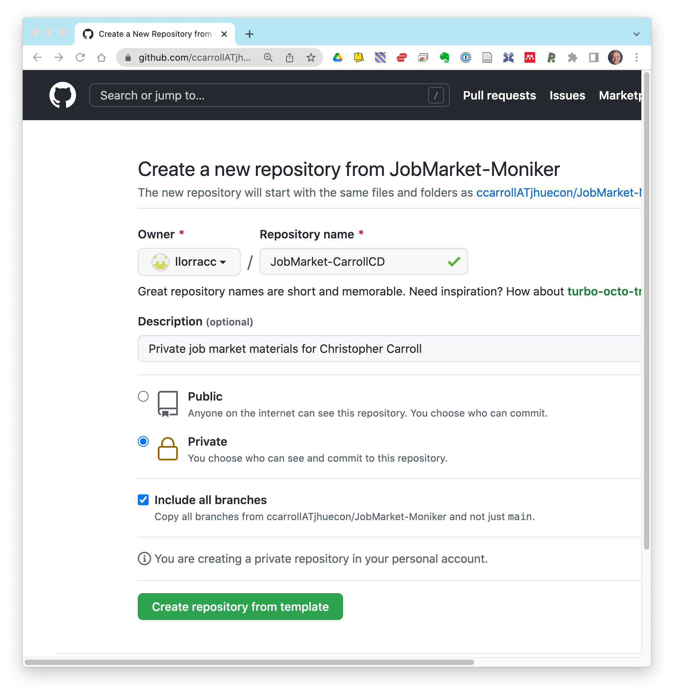

# JobMarket-Moniker

Private materials for the job market should be kept your own customized version of this repository.

You should customize the files herein ONLY by the substitution of [your moniker](https://github.com/llorracc/JobMarket/blob/master/Notation#Moniker) for the word `Moniker`

Steps:

1. Get a GitHub ID by creating a GitHub account (if you don't already have one)
   * If you don't have one, a natural choice of GitHub ID would be your Moniker
1. Log into your GitHub account with your GitHubID
1. Navigate to the 'template' repository that you will be cloning from:
   * https://github.com/ccarrollATjhuecon/JobMarket-Moniker
1. Click the green "Use This Template" button in the upper right to create a new repo
   * It will be created under your GitHubID
   * You should give the repo the name 'JobMarket-[your-moniker-here]'
   * Make it a "Private" repo
   * Click "include all branches"
   * Click the  button
   

If you are at least a little bit familiar with how git and GitHub work:
   * Make a local clone of the remote repo on your computer
   * Use the usual git/GitHub workflow to update materials in your repo
   
Otherwise, you can just "upload" files from your local computer to the repo.

For example, you should replace `MemoMoniker.pdf` with your actual memo 

Other content should be self explanatory.

